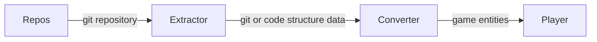

# Waking-git architecture (draft)

This is a rough description of what the program architecture is supposed to look like.

## How does it work ?

- We first pass to the program a `git` repository `http` or `https` url.
  The repository url can come from github.com, gitlab.com or any other source.
- The repository will then be scanned and a set of relevant data will be extracted from the repository tree and source code.
  This data will be stored in a directory named after a slug of your repository `owner/name`.
- The Player will use data extracted from your repository to create a world to explore.

### Components



From the **Repos** we fetched and stored on disk, the **Extractor** will get data about the git tree
and the code structure. This data will then be picked up and **Converted** into a list of game entities
such as NPCs, enemies, bosses and decors. This list of entities will be used by the **Player**
to generate the game or simulated world.

#### Repos

This is the git repository pulled from a webserver or present on disk, that will be used
as a data source for `waking-git`.

#### Extractor

It will go through your repository and extract data from your git object tree and
your source code architecture.

From your `git object tree` will be extracted data such as:

- commit objects
- blob objects
- lfs objects (they are blob objects but might be treated differently by the extractor)
- tag objects
- tree objects
- refs
- the size, name and permissions of each file and directory
- data regarding your git repository overall health, using `git-sizer` for example

In the `source code architecture` we can find these interesting artifacts:

- code metrics: (we can get those from [rust_code_analysis](https://docs.rs/rust-code-analysis/latest/rust_code_analysis/index.html))
  - CC: it calculates the code complexity examining the control flow of a program.
  - SLOC: it counts the number of lines in a source file.
  - PLOC: it counts the number of physical lines (instructions) contained in a source file.
  - LLOC: it counts the number of logical lines (statements) contained in a source file.
  - CLOC: it counts the number of comments in a source file.
  - BLANK: it counts the number of blank lines in a source file.
  - HALSTEAD: it is a suite that provides a series of information, such as the effort required to maintain the analyzed code, the size in bits to store the program, the difficulty to understand the code, an estimate of the number of bugs present in the codebase, and an estimate of the time needed to implement the software.
  - MI: it is a suite that allows to evaluate the maintainability of a software.
  - NOM: it counts the number of functions and closures in a file/trait/class.
  - NEXITS: it counts the number of possible exit points from a method/function.
  - NARGS: it counts the number of arguments of a function/method.
- lines of code per file
- file type
- programming languages
- code structure:
  - functions
  - classes
  - variables
  - const
  - structs
  - interfaces/traits
  - etc...
- code smells (non idomatic ways of writing code, depends on the programming language)
- linting issues (we can run standard linters on the project)
- security breaches
- code comments (can be used to generate stories or dialogue for NPC characters)

**Output:**

The extractor will spit out a list of data points, that can then be stored in a json file.

<details>
<summary><b>Example of json data</b></summary>

```json
{
  "git_health": {
    "commits": {
      "count": "723k",
      "total_size": "525 Mib"
    },
    "tree": {
      "count": "3.40 M",
      "total_size": "9.00 Gib",
      "total_tree_entries": "264 M"
    }
    //...more entries refer to git-sizer's output -> https://github.com/github/git-sizer#usage
  },
  "objects": [
    "data_point_hash_blob": {
      "type": "git",
      "git": {
        "type": "blob",
        "sha": "eb50cab7d9c22101393e693c00aeff662e256d1b",
        "permissions": "100644",
        "name": "README.md"
      }
    },
    "data_point_hash_tree": {
      "type": "git",
      "git": {
        "type": "tree",
        "sha": "01da9bd182c510aea3bf57281c9b31b5d571a730",
        "permissions": "", //This is the root tree so it does not have permissions (still not 100% sure about that though)
        "name": "", //root tree should have no name
        "objects": [
          {"blob": "eb50cab7d9c22101393e693c00aeff662e256d1b"} , //the sha of the `README.md` blob object
          {"tree": "accb07f852119953193bf379799e2cafbf3505fd"}, //cmd tree object
          {"blob": "f2e389d48f79b0909bd7ad0c6ce5299a019f1cc7"}, //LICENCE blob object
        ]
      }
    },
    "data_point_hash_commit": {
      "type": "git",
      "dangling": true, //the commit is unreachable
      "git": {
          "type": "commit",
          "sha": "01da9bd182c510aea3bf57281c9b31b5d571a730",
          "author": "goreleaserbot <goreleaser@carlosbecker.com> 1630490004 +0200", //root tree should have no name
          "commiter": "GitHub <noreply@github.com> 1635941609 +0100",
          "message": "Brew formula update for ckp version v0.17.1", //commit message
          "objects": [
            "tree": "accb07f852119953193bf379799e2cafbf3505fd", //cmd tree object
            "parents": [
              "d87dddc4fed262617ee27928bb65cc45274c96ca",
              "" //it is possible to have more than one parent only if it is a merge commit
            ]
          ]
      }
    },
    "data_point_hash_code": {
      type": "code"
      //...TODO, write objects extracted from code structure static analysis
    }
  ]
  //...TODO expand this example as our understanding of the structure increases
  }
}
```

</details>

#### Converter

The **Converter** receives a set of data points and transforms them into a list of entities
that are understandable by the **Player** such as NPCs, enemies, bosses and decors elements.

<details>
<summary><b>Example of json data</b></summary>

```json
[
  {
    "type": "npc",
    "name": "main.c",
    "entity": {
      "type": "pedestrian",
      "class": "villager",
      //dialogue can be extracted from file comments or file commit messages (less sure about the former)
      "dialogue": [
        { "line": 10, "comment": "a comment someone left in the code" },
        { "line": 15, "comment": "a comment found on a function" }
      ],
      //when the position is not specified the entity can be placed anywhere on screen
      "position": {
        "x": 1,
        "y": 10
      }
    }
  },
  {
    "type": "ennemy",
    "name": "sha",
    "entity": {
      //ghosts can be generated from dangling commits or blobs
      "type": "ghost",
      "class": "c",
      "position": {
        "x": 90,
        "y": 20
      }
    }
  },
  {
    "type": "decor",
    "name": "sha",
    "entity": {
      "type": "block",
      "class": "a",
      "position": {
        "x": 0,
        "y": 0
      }
    }
  },
  {
    "type": "boss",
    "name": "sha",
    "entity": {
      //ghosts can be generated from dangling commits or blobs
      "type": "data-race",
      "class": "a",
      //dialogue can be extracted from file comments or file commit messages (less sure about the former)
      "dialogue": [
        { "line": 10, "comment": "a comment someone left in the code" },
        { "line": 15, "comment": "a comment found on a function" }
        //...more
      ],
      //when the position is not specified the entity can be placed anywhere on screen
      "position": {
        "x": 1,
        "y": 10
      }
    }
  }
  //...more
]
```

</details>

#### Player

It ingests data from the converter and generates a 2D/3D playable game/simulator.

## How to run?

### Code scanner:

The code scanner receives an https url and an optional commit `reference`
to download the repository content, if the reference is not specified
the scanner will use the main branch as default reference and download.

```console
$ wake scan https://github.com/elhmn/ckp <reference>
```

The code scanner will analyse your repository tree structure and your source file,
and generate a set of files that will later be used by the world generator to create
a playable 2D or 3D world.

### The player:

The player uses data extracted by the `code scanner` to generate a playable world.

```console
$ wake play --dir <path_to_the_directory_generated_by_the_code_scanner>
```

you can use the `--dir` flag to set the directory that should be used to generate the world
use to create the world to explore.

The player can also use the `https` url of your source code. This will automatically call
the scanner and create the playable world created by the scanner.

```console
$ wake play <the_https_url_of_your_source_code>
```
